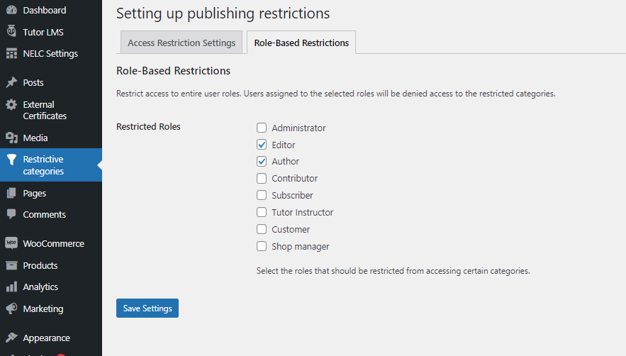
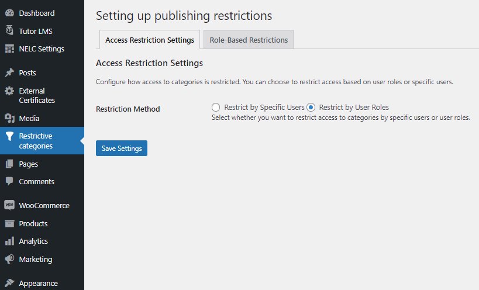
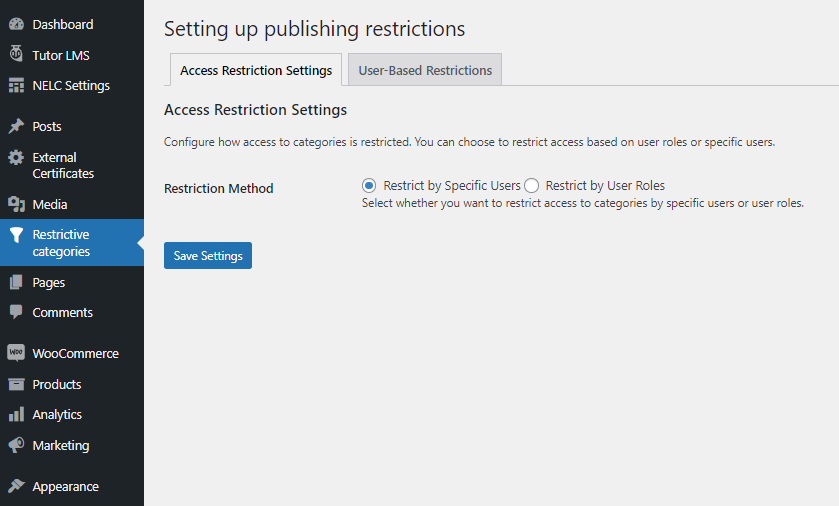
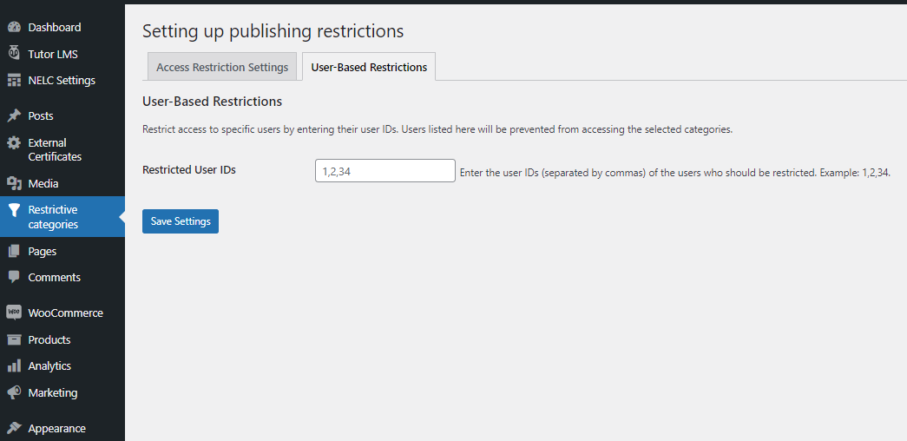
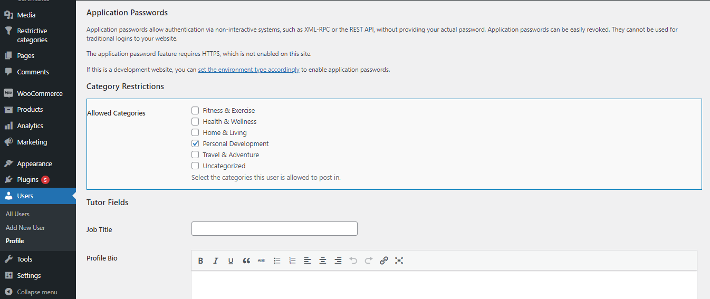

# Bzzix Restrictive Categories

**Contributors:** Mahmoud Hassan  
**Tags:** wordpress, plugin, categories, restrictions  
**Requires at least:** 5.0  
**Tested up to:** 6.3  
**Stable tag:** 1.0  
**License:** GPLv2 or later  
**License URI:** http://www.gnu.org/licenses/gpl-2.0.html  

Restrict users from posting in specific categories based on their roles or user settings.

## Description

Bzzix Restrictive Categories is a WordPress plugin that allows administrators to limit users from posting in certain categories. Restrictions can be applied based on user roles or individual user accounts.

### Features:
- Restrict users from posting in specific categories.
- Limit users based on roles or individual settings.
- Automatically filter and display only allowed categories for restricted users.
- Prevent users from selecting unauthorized categories when publishing posts.

## Installation

You can install the plugin by following these steps:

1. Download the plugin ZIP file.
2. Upload the ZIP file via the `Plugins > Add New > Upload` screen in your WordPress dashboard.
3. Activate the plugin through the `Plugins` menu in WordPress.

## Usage

1. Go to `Settings > Restrictive Categories` in your WordPress dashboard.  
2. Choose whether to restrict users by role or by individual selection.  
3. If restricting by role, specify which roles should be restricted.  
4. If restricting by individual users, enter user IDs separated by commas (`,`).  
5. Go to the profile edit page of restricted users and select the categories they are allowed to post in.  
6. Restricted users will only be able to publish posts in their assigned categories.  

## Screenshots

1. **Settings Page:** Configure category restrictions.
   
   

2. **User Profile Page:** Set allowed categories per user.
   
   

3. **Profile Editor:** Restricted users can only select allowed categories.
   

## Frequently Asked Questions

### Q: Can I restrict users based on their roles?  
Yes, you can specify roles that should be restricted from posting in certain categories.

### Q: Can I assign category restrictions to individual users?  
Yes, administrators can assign allowed categories to specific users.

### Q: What happens if a restricted user tries to post in an unauthorized category?  
The plugin will prevent the post from being published and display an error message.

## Changelog

### 1.0
- Initial release.

## License

This plugin is licensed under the GPLv2 or later. See [GNU General Public License](http://www.gnu.org/licenses/gpl-2.0.html) for details.
